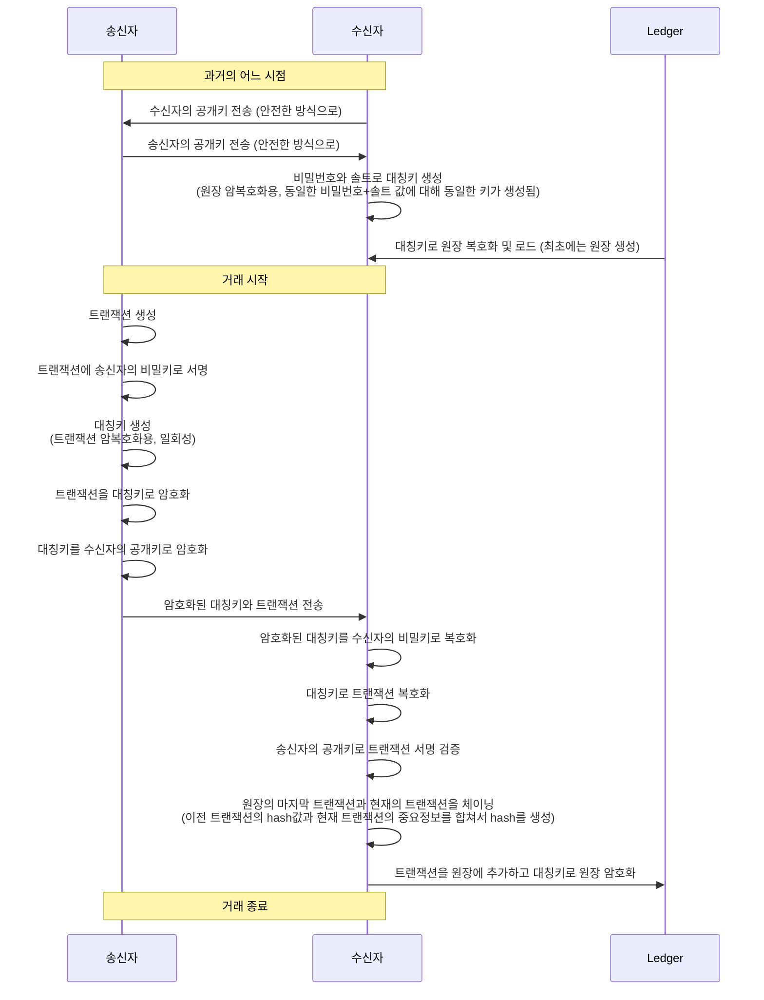
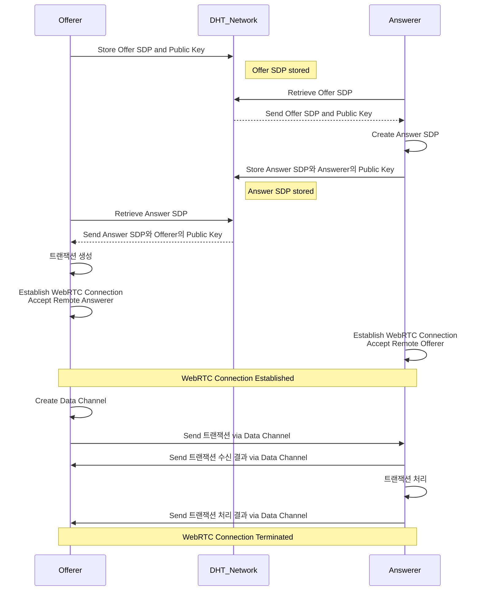

# 블록체인과 P2P 기술을 기반으로 한 안전한 트랜잭션 시스템 소개

## 1. 서론 (Introduction)
블록체인과 P2P 기술은 데이터 보안과 실시간 통신에 강점을 가진 기술입니다. 이 보고서는 이러한 기술을 결합하여 송신자와 수신자 간의 트랜잭션을 안전하게 생성, 전송, 수신, 저장할 수 있는 시스템을 제안합니다.

---

## 2. 시스템 개요 (System Overview)
### 목적
- 송신자와 수신자 간의 트랜잭션을 안전하게 생성, 전송, 수신, 저장하는 시스템.

### 구성 요소
- **Transaction 클래스**: 트랜잭션의 기본 정보(송신자, 수신자, 금액 등) 관리.
- **Ledger 클래스**: 트랜잭션의 연속성을 유지하고 무결성을 검증하며, 데이터를 암호화하여 저장.
- **키 관리 모듈**: RSA 공개키와 비밀키의 생성, 저장, 로드 담당.
- **암호화/복호화 모듈**: 대칭키와 비대칭키를 사용한 데이터 암호화 및 복호화.
- **통신 모듈**: DHT와 WebRTC를 활용하여 Offerer와 Answerer 간의 신뢰성 있는 데이터 전송을 담당.

---

## 3. 블록체인 기반 가치 이전 절차 (Blockchain-based Value Transfer Process)

---

## 4. P2P 네트워크 통신 절차 (Peer-to-Peer Network Communication Process)

---

## 5. 키 관리 (Key Management)
- **RSA 키 쌍 생성**:
  - 2048비트 RSA 비밀키와 공개키 생성.
  - 높은 보안을 위해 필요에 따라 3072비트 또는 4096비트 키 사용 가능.
- **키의 저장 및 로드**:
  - 비밀키, 공개키를 PEM 형식으로 파일에 저장하고 로드.
- **키의 역할**:
  - **비밀키**: 트랜잭션 서명 및 대칭키 복호화에 사용.
  - **공개키**: 서명 검증 및 대칭키 암호화에 사용.

---

## 6. 트랜잭션 처리 (Transaction Processing)
- **트랜잭션 생성**:
  - `Transaction` 클래스는 송신자 ID, 수신자 ID, 금액, 타임스탬프, 이전 트랜잭션의 해시 등을 포함.
- **디지털 서명**:
  - 송신자의 비밀키로 트랜잭션 데이터를 서명.
- **데이터 암호화**:
  - **대칭키 암호화 (AES-GCM)**:
    - 트랜잭션 데이터를 AES-GCM 모드로 암호화.
  - **대칭키 암호화**:
    - 대칭키는 수신자의 공개키로 암호화하여 안전하게 전송.
- **데이터 전송**:
  - 암호화된 트랜잭션 데이터와 암호화된 대칭키를 JSON 형식으로 전송.

---

## 7. 원장 관리 (Ledger Management)
- **트랜잭션 추가**:
  - 트랜잭션의 이전 해시와 현재 해시를 검증 후 원장에 추가.
- **무결성 검증**:
  - 트랜잭션 체인의 무결성 검증.
- **데이터 저장 및 로드**:
  - 원장을 JSON으로 직렬화하고 AES-Fernet을 사용하여 암호화된 상태로 파일에 저장.

---

## 8. 암호화 기법 (Encryption Techniques)
- **비대칭 암호화 (RSA)**:
  - 대칭키 암호화.
- **대칭 암호화 (AES-GCM)**:
  - 트랜잭션 데이터를 암호화.
- **키 도출 함수 (PBKDF2)**:
  - 사용자 비밀번호와 솔트로 키 생성.
- **해시 함수 (SHA-256)**:
  - 데이터의 무결성을 확인.

---

## 9. 데이터 흐름 및 보안 메커니즘 (Data Flow and Security Mechanisms)
1. **트랜잭션 생성** 및 **서명**
2. **데이터 암호화 및 전송**
3. **데이터 수신 및 복호화**
4. **원장에 추가 및 무결성 검증**
5. **통신 메커니즘 (DHT 및 WebRTC)**

---

## 10. DHT 및 WebRTC 기술 (DHT and WebRTC Technologies)
- **분산 해시 테이블 (DHT)**:
  - **역할**: SDP 교환, 확장성, 내결함성.
- **WebRTC**:
  - **역할**: P2P 통신, 데이터 채널을 통한 데이터 전송.

---

## 11. 보안상의 장점 (Security Benefits)
- **기밀성, 무결성, 인증, 키 관리, 확장성, 내결함성**
- **실시간 통신 보안**: DTLS와 SRTP

---

## 12. 사용된 라이브러리 및 도구 (Libraries and Tools Used)
- Python cryptography, Hashlib, Kademlia, aiortc 등