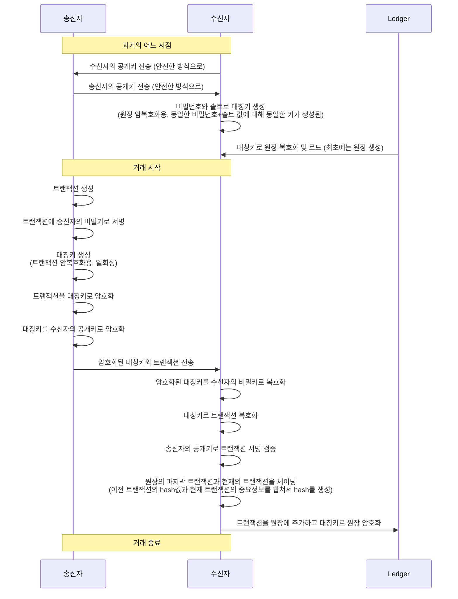
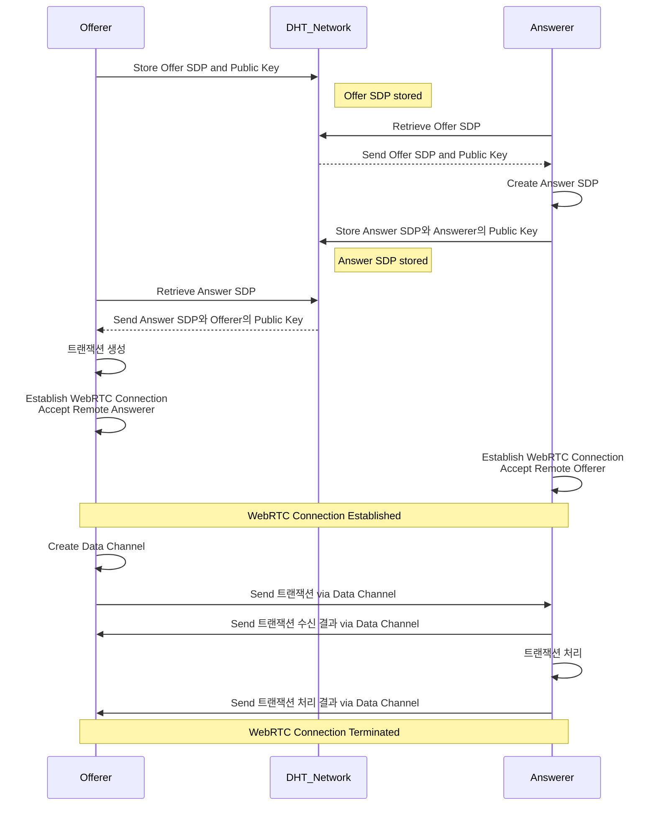

# 블록체인 기반 가치 이전 (Blockchain-based Value Transfer)

# 탈중앙화 네트워크 설계(Decentralized Network Design)

**블록체인과 P2P 기술을 기반으로 한 안전한 트랜잭션 시스템**의 구현에 사용된 주요 기술들과 그 작동 방식을 설명합니다.

---

#### 1. 시스템 개요
- **목적**: 송신자와 수신자 간의 트랜잭션을 안전하게 생성, 전송, 수신, 저장하는 시스템.
- **구성 요소**:
  - **Transaction 클래스**: 트랜잭션의 기본 정보(송신자, 수신자, 금액 등)를 관리.
  - **Ledger 클래스**: 트랜잭션의 연속성을 유지하고, 무결성을 검증하며, 데이터를 암호화하여 저장.
  - **키 관리 모듈**: RSA 공개키와 비밀키의 생성, 저장, 로드를 담당.
  - **암호화/복호화 모듈**: 트랜잭션 데이터의 기밀성을 보장하기 위해 대칭키와 비대칭키를 사용한 암호화 및 복호화 수행.
  - **통신 모듈**: DHT와 WebRTC를 활용하여 Offerer와 Answerer 간의 신뢰성 있는 데이터 전송을 담당.

---
    
#### 2. 키 관리
- **RSA 키 쌍 생성**:
  - 2048비트 RSA 비밀키와 공개키 생성.
  - 높은 보안을 위해 필요에 따라 3072비트 또는 4096비트 키 사용 가능.
- **키의 저장 및 로드**:
  - 비밀키, 공개키를 PEM 형식으로 파일에 저장하고 로드.
- **키의 역할**:
  - **비밀키**: 트랜잭션 서명 및 대칭키 복호화에 사용.
  - **공개키**: 서명 검증 및 대칭키 암호화에 사용.
    
---
    
#### 3. 트랜잭션 처리
- **트랜잭션 생성**:
  - `Transaction` 클래스는 송신자 ID, 수신자 ID, 금액, 타임스탬프, 이전 트랜잭션의 해시 등을 포함.
  - 각 트랜잭션은 고유의 `current_hash`를 계산하여 무결성을 보장.
- **디지털 서명**:
  - 송신자의 비밀키로 트랜잭션 데이터를 서명.
  - 서명은 트랜잭션의 무결성과 송신자의 인증을 보장.
- **데이터 암호화**:
  - **대칭키 암호화 (AES-GCM)**:
    - 트랜잭션 데이터를 AES-GCM 모드를 사용하여 암호화.
    - AES-GCM은 기밀성과 무결성을 동시에 제공하는 대칭 암호화 방식.
  - **대칭키 암호화**:
    - 생성된 대칭키는 수신자의 공개키로 암호화하여 안전하게 전송.
    - 함수는 RSA-OAEP 패딩을 사용하여 대칭키를 암호화.
- **데이터 전송**:
  - 암호화된 트랜잭션 데이터와 암호화된 대칭키를 JSON 형식으로 패키징하여 전송 또는 파일 저장.
    
---
    
#### 4. 원장 관리 (Ledger)
- **트랜잭션 추가**:
  - 트랜잭션의 이전 해시와 현재 해시를 검증한 후 원장에 추가.
  - 첫 번째 트랜잭션의 이전 해시는 고정된 값('0' * 64)으로 설정.
- **무결성 검증**:
  - 모든 트랜잭션의 해시를 재계산하고 체인 내의 연결성을 확인.
  - 트랜잭션 체인의 변경 여부를 감지하여 데이터의 무결성을 보장.
- **데이터 저장 및 로드**:
  - 원장을 JSON으로 직렬화하고 AES-Fernet을 사용하여 암호화된 상태로 파일에 저장.
  - 암호화 키는 사용자 비밀번호로부터 파생된 키를 사용하여 데이터의 기밀성을 유지.
    
---
    
#### 5. 암호화 기법
- **비대칭 암호화 (RSA)**:
  - 데이터 전송 시 대칭키를 암호화하여 기밀성을 보장.
  - 디지털 서명을 통해 송신자의 인증과 데이터 무결성 검증.
- **대칭 암호화 (AES-GCM)**:
  - 트랜잭션 데이터를 빠르고 안전하게 암호화.
  - AES-GCM 모드는 인증 태그를 포함하여 데이터의 무결성을 추가로 보장.
- **키 도출 함수 (PBKDF2)**:
  - 사용자의 비밀번호와 솔트를 사용하여 강력한 암호화 키를 생성.
  - 높은 반복 횟수를 통해 사전 공격에 대한 저항력을 강화.
- **해시 함수 (SHA-256)**:
  - 트랜잭션의 고유 식별자로 사용되며, 데이터의 무결성을 확인하는 데 사용.
  - `hashlib.sha256`을 통해 JSON 직렬화된 트랜잭션 데이터의 해시값을 계산.
    
---
    
#### 6. 사용된 라이브러리 및 도구
- **Python `cryptography` 라이브러리**:
  - 고수준의 암호화 기능을 제공하여 안전한 키 생성, 암호화/복호화, 서명 및 검증을 지원.
  - HAZMAT(위험한 재료) 모듈을 사용하여 저수준의 암호화 작업을 수행.
- **Hashlib**:
  - SHA-256 해시 함수를 사용하여 트랜잭션의 무결성을 보장.
- **Fernet**:
  - 대칭키 암호화 방식으로 AES를 기반으로 하며, 간편한 사용법과 안전한 기본 설정을 제공.
- **Kademlia**:
  - 분산 해시 테이블(DHT)을 구현하기 위한 라이브러리로, P2P 네트워크에서 데이터의 분산 저장과 검색을 지원.
- **aiortc**:
  - WebRTC와 ORTC의 구현체로, Python에서 실시간 통신을 지원하는 라이브러리.
    
---
    
#### 7. 데이터 흐름 및 보안 메커니즘
1. **트랜잭션 생성**:
   - 송신자가 트랜잭션을 생성하고 자신의 비밀키로 서명.
2. **데이터 암호화 및 전송**:
   - 트랜잭션 데이터를 AES-GCM으로 암호화.
   - 대칭키를 수신자의 공개키로 암호화.
   - 암호화된 데이터와 암호화된 대칭키를 DHT를 통해 WebRTC 연결을 설정하여 전송.
3. **데이터 수신 및 복호화**:
   - 수신자가 자신의 비밀키로 대칭키를 복호화.
   - 복호화된 대칭키로 트랜잭션 데이터를 복호화.
   - 서명을 검증하여 트랜잭션의 진위 확인.
4. **원장에 추가 및 무결성 검증**:
   - 검증된 트랜잭션을 원장에 추가.
   - 전체 원장의 무결성을 재검증.
   - 원장을 암호화된 파일로 저장하여 데이터 보호.
5. **통신 메커니즘**:
   - **DHT**: Offerer와 Answerer 간의 SDP(세션 설명 프로토콜) 정보를 저장하고 검색하는 데 사용.
   - **WebRTC**: 실시간 P2P 통신을 통해 데이터 채널을 설정하고 트랜잭션 데이터를 전송.
   - **Offerer**: WebRTC 연결을 시작하는 역할로, SDP를 DHT에 저장.
   - **Answerer**: Offerer의 SDP를 DHT에서 검색하여 WebRTC 연결에 응답.
    
---
    
#### 8. DHT 및 WebRTC 기술
- **분산 해시 테이블 (DHT)**:
  - **정의**: DHT는 분산 네트워크 상에서 키-값 쌍을 효율적으로 저장하고 검색할 수 있는 시스템입니다.
  - **역할**:
    - **SDP 교환**: Offerer가 생성한 SDP(세션 설명 프로토콜) 정보를 DHT에 저장하고, Answerer가 이를 검색하여 WebRTC 연결을 설정.
    - **확장성**: 분산된 네트워크 구조로 인해 중앙 집중식 서버 없이도 데이터의 분산 저장과 검색이 가능.
  - **장점**:
    - **내결함성**: 네트워크의 일부 노드가 실패해도 전체 시스템의 동작에 영향을 미치지 않음.
    - **확장성**: 노드 수가 증가해도 성능 저하 없이 데이터 관리를 지속할 수 있음.
    
- **WebRTC (Web Real-Time Communication)**:
  - **정의**: WebRTC는 웹 애플리케이션과 사이트가 브라우저 간에 실시간 통신을 가능하게 하는 기술입니다.
  - **역할**:
    - **P2P 통신**: Offerer와 Answerer 간의 직접적인 데이터 채널을 설정하여 트랜잭션 데이터를 안전하게 전송.
    - **미디어 및 데이터**: 비디오, 오디오뿐만 아니라 일반 데이터 전송도 지원.
  - **통신 과정**:
    1. **Offerer**:
       - WebRTC PeerConnection을 생성하고, 데이터 채널을 설정.
       - SDP Offer를 생성하고, DHT에 저장.
    2. **Answerer**:
       - DHT에서 SDP Offer를 검색.
       - PeerConnection을 설정하고, SDP Answer를 생성하여 DHT에 저장.
    3. **신호 교환**:
       - DHT를 통해 Offerer와 Answerer가 SDP 정보를 교환하여 직접적인 WebRTC 연결을 설정.
    4. **데이터 전송**:
       - 설정된 데이터 채널을 통해 암호화된 트랜잭션 데이터 전송.
  - **장점**:
    - **저지연성**: 직접 P2P 연결을 통해 데이터 전송 지연을 최소화.
    - **보안**: DTLS와 SRTP를 사용하여 전송되는 데이터의 보안을 보장.
    
---
    
#### 9. 보안상의 장점
- **기밀성**: 트랜잭션 데이터는 AES-GCM으로 암호화되어 외부로부터 보호됩니다.
- **무결성**: SHA-256 해시와 디지털 서명을 통해 데이터의 변경 여부를 검증할 수 있습니다.
- **인증**: 디지털 서명을 통해 트랜잭션의 송신자를 신뢰할 수 있습니다.
- **키 관리**: 비대칭 암호화를 통해 대칭키의 안전한 전달이 가능하며, PBKDF2를 통한 키 도출로 비밀번호의 보안을 강화합니다.
- **확장성**: 새로운 트랜잭션이 원장에 체인 형태로 추가되어 블록체인과 유사한 구조를 유지, 확장 가능합니다.
- **내결함성 및 확장성**: DHT의 분산 구조로 인해 시스템의 내결함성과 확장성이 향상됩니다.
- **실시간 통신 보안**: WebRTC의 DTLS와 SRTP를 통해 데이터 전송의 보안을 보장.
    
---
    
### 결론
이번 시스템 구현은 다양한 암호화 기술과 보안 메커니즘을 결합하여 안전하고 신뢰할 수 있는 트랜잭션 처리 및 원장 관리 시스템을 구축하였습니다. DHT와 WebRTC의 통합을 통해 분산된 환경에서도 효율적이고 안전한 데이터 전송을 가능하게 했습니다. 이를 통해 데이터의 기밀성, 무결성, 인증을 효과적으로 보장할 수 있으며, 블록체인 기술의 핵심 원리를 실습적으로 이해할 수 있었습니다. 향후 시스템의 확장 및 실전 적용을 통해 더욱 발전된 보안 솔루션을 제공할 수 있을 것입니다.

---

위의 내용을 통해 시스템의 DHT 및 WebRTC 관련 기술을 포함한 전체적인 구조와 보안 메커니즘을 더욱 명확하게 이해할 수 있습니다. 추가적인 질문이나 수정이 필요하시면 언제든지 문의해주세요!

---

To implement the sequence diagram as a program across Windows, macOS, Android, and iOS platforms, a few key technologies and approaches would be suitable:

### 1. **Cross-Platform Development Frameworks**
   - **Flutter** or **React Native**: These frameworks allow you to write the code once and deploy it across all targeted platforms. Both support integrating native modules for platform-specific functionality, such as cryptographic operations.
   - **Xamarin**: This is a C#-based framework that can also target multiple platforms, including mobile and desktop.

### 2. **Programming Languages**
   - **For Mobile (Android & iOS)**:
     - **Kotlin/Java** for Android and **Swift/Objective-C** for iOS if developing separately.
     - **Dart (Flutter)** or **JavaScript/TypeScript (React Native)** for cross-platform apps.
   - **For Desktop (Windows & macOS)**:
     - **C++/C#** or **Python** for shared core logic.
     - **Electron** if you want to use web technologies for the desktop UI.

### 3. **P2P Communication**
   - **libp2p**: A modular network stack that supports P2P communication. It is available in multiple languages (JavaScript, Go, Rust) and can be integrated into various platforms.
   - **WebRTC**: Useful for establishing peer-to-peer communication, especially for real-time data exchange between devices.
   - **gRPC**: Can be configured for P2P, although primarily for client-server. It supports multiple languages and has mobile libraries.

### 4. **Cryptography**
   - **OpenSSL**: Commonly used for cryptographic operations. It's available on all platforms and can be integrated into mobile and desktop applications.
   - **Libsodium**: Another reliable cryptography library that is cross-platform and easier to use than OpenSSL.
   - **BouncyCastle**: For Java/Kotlin (Android) and can be used with .NET (Xamarin) for encryption.

### 5. **Blockchain or Ledger Implementation**
   - **Hyperledger Fabric** or **Corda**: If you need a more complex and distributed ledger, these frameworks support permissioned blockchains.
   - **SQLite**: For a simpler local ledger, especially if each device maintains its copy and syncs over P2P communication.
   - **Custom Blockchain Implementation**: Using a simplified blockchain design based on the P2P logic you want to create.

### 6. **Key Management**
   - **Keychain (iOS/macOS)** and **Keystore (Android)** for secure key storage.
   - **Windows Data Protection API (DPAPI)** for storing cryptographic keys securely on Windows.
   - **Hardware Security Modules (HSM)** or **TPMs** can provide enhanced security for key management if available.
   - 공개키 교환은 Diffie-Hellman 방식으로 한다.

### Development Flow Example
1. **Core Logic**: Write the cryptographic, transaction creation, and validation logic in a language that can be reused across platforms (e.g., C++/Python).
2. **P2P Communication**: Implement using `libp2p` or `WebRTC` to allow direct communication between sender and receiver.
3. **Cryptographic Operations**: Use `Libsodium` or `OpenSSL` for encryption, decryption, and digital signatures.
4. **Platform-Specific Modules**: Write wrappers around native APIs to handle key storage and OS-specific optimizations.

By combining these tools and frameworks, you can develop a robust, cross-platform solution that aligns with your sequence diagram.

---

### 사용할 기술
#### Programming Languages : React Native For Mobile, Electron For Desktop
#### P2P Communication : WebRTC
- peer lookup : DHT (분산 해시 테이블)
#### Cryptography :
#### Blockchain or Ledger Implementation :
#### Key Management : 각자 platform에 맞게

---

WebRTC와 DHT의 조합은 전혀 이상하지 않으며, 오히려 **상호 보완적**으로 사용될 수 있습니다. 두 기술의 장점을 활용하면 P2P 네트워크에서 더 효율적이고 확장 가능한 시스템을 구축할 수 있습니다. 각 기술의 특징과 조합하는 방식에 대해 자세히 설명하겠습니다.

### 1. **WebRTC와 DHT의 역할**
   - **WebRTC**:
     - WebRTC는 **직접적인 P2P 통신**을 가능하게 해주는 기술로, **낮은 지연 시간**의 실시간 데이터 전송이 특징입니다.
     - **STUN/TURN** 서버를 통해 NAT 및 방화벽 문제를 해결하고, 직접 연결을 설정할 수 있게 합니다.
     - 주로 **데이터 전송**과 **미디어 스트리밍**에 적합하며, **RTCDataChannel**을 사용해 파일이나 텍스트 데이터도 전송할 수 있습니다.
   
   - **DHT**:
     - DHT는 **분산 네트워크**에서 피어를 찾아주는 역할을 하며, **중앙 서버 없이** 데이터를 저장하고 검색할 수 있습니다.
     - 노드(피어)들이 서로의 주소 정보를 DHT에 등록하면, 송신자가 수신자를 찾기 위해 DHT에 조회를 할 수 있습니다.
     - **분산 검색**을 통해 피어를 빠르게 찾고, 각 노드의 IP 주소나 연결 정보를 얻어 올 수 있습니다.

### 2. **WebRTC와 DHT의 조합이 유용한 이유**
   - **P2P 연결 설정을 위한 피어 검색**: WebRTC는 직접 연결을 설정하기 위해 초기 단계에서 **Signaling Server**를 사용합니다. 이 서버는 송신자와 수신자 간의 연결 정보를 교환하는 역할을 하지만, 중앙 서버에 의존하기 때문에 완전한 분산 시스템이라고 보기 어렵습니다.
     - **DHT를 Signaling Server 대용으로 사용**하면, 송신자와 수신자가 각자의 연결 정보를 DHT에 등록하고 검색할 수 있게 되어, 중앙 서버 없이도 피어를 찾고 연결할 수 있습니다.
     - 예를 들어, 송신자가 수신자의 고유 ID (예: 해시 값)를 알고 있다면, DHT를 통해 그 ID에 해당하는 피어의 연결 정보를 조회하고 WebRTC 연결을 설정할 수 있습니다.

   - **분산 네트워크의 확장성**: DHT는 네트워크가 커질수록 확장성이 뛰어나며, 새로운 노드가 자유롭게 추가되고 삭제될 수 있습니다. WebRTC로 설정된 P2P 연결이 DHT를 통해 피어 간의 확장성을 높일 수 있습니다.
     - 예를 들어, **BitTorrent**의 경우 DHT를 사용해 피어를 검색하고, 데이터를 전송할 때는 TCP/UDP 연결을 사용합니다. 이 방식과 유사하게 DHT로 피어를 찾고 WebRTC를 통해 데이터를 전송하는 구조를 설계할 수 있습니다.

   - **네트워크 안정성 및 탈중앙화**: 중앙 서버에 의존하지 않기 때문에 서버 장애 시에도 네트워크가 안정적으로 운영될 수 있습니다. DHT는 네트워크의 참여자들 간에 데이터를 분산하여 저장하고 관리하므로, **서버 장애의 위험성**을 최소화합니다.

### 3. **WebRTC + DHT 조합의 실제 동작 예시**
1. **피어 등록 및 검색 (DHT)**
   - 수신자는 자신의 **공개 IP 주소 및 포트 정보**를 DHT에 등록합니다. 이 정보는 WebRTC 연결을 설정할 때 사용할 수 있습니다.
   - 송신자가 특정 수신자에게 연결하고 싶다면, DHT를 통해 수신자의 IP 주소 및 포트 정보를 검색합니다.
   
2. **WebRTC 연결 설정 (P2P)**
   - 송신자는 검색된 정보를 바탕으로 WebRTC의 **Signaling** 절차를 수행합니다. 송신자와 수신자는 ICE Candidate 정보를 교환하여 최적의 P2P 경로를 설정합니다.
   - 이 과정에서 DHT는 초기 Signaling 서버의 역할을 대신하게 됩니다.

3. **데이터 전송**
   - 연결이 설정되면 **RTCDataChannel**을 통해 송신자와 수신자는 실시간으로 데이터를 주고받을 수 있습니다.
   - 이때 WebRTC는 NAT 방화벽을 넘어서 P2P 연결을 유지하며, **STUN/TURN 서버**를 통해 필요할 경우 중계 역할을 수행합니다.

### 4. **구체적인 사용 사례**
   - **P2P 파일 공유 애플리케이션**: 기존 BitTorrent와 유사한 방식으로, WebRTC와 DHT를 조합하여 완전한 탈중앙화 파일 공유 네트워크를 구축할 수 있습니다.
     - DHT를 사용해 파일을 가지고 있는 피어들을 찾고, WebRTC를 통해 파일을 직접 다운로드합니다.
   - **분산 메시징 시스템**: 중앙 서버 없이 WebRTC를 통해 메시지를 실시간으로 주고받을 수 있습니다.
     - 송신자가 메시지를 전송하기 전에 DHT로 수신자를 찾고, WebRTC 연결을 설정해 안전한 메시지를 전송합니다.
   - **P2P 게임 네트워크**: 게임 내에서 플레이어들 간의 직접 연결을 통해 빠르고 지연 없는 네트워크 환경을 제공합니다.
     - 플레이어의 IP 및 연결 정보는 DHT에 등록되어 있으며, 게임 세션이 시작되면 WebRTC를 통해 연결이 설정됩니다.

### 5. **잠재적인 도전 과제 및 해결 방안**
   - **NAT Traversal 문제**: DHT는 피어의 실제 IP 주소와 포트를 사용하기 때문에 NAT 방화벽이 있을 경우 문제가 발생할 수 있습니다. WebRTC의 **STUN/TURN** 서버를 활용해 NAT 문제를 해결할 수 있습니다.
   - **보안 문제**: DHT는 기본적으로 공개된 분산 네트워크이기 때문에, 모든 피어가 데이터를 볼 수 있습니다. WebRTC 연결을 통해 전송할 데이터는 **암호화**하는 것이 필요합니다. WebRTC는 기본적으로 **DTLS**를 사용해 데이터 전송을 암호화합니다.
   - **DHT의 안정성**: 네트워크에 악의적인 피어가 있다면 잘못된 정보를 전송할 수 있습니다. **신뢰 기반의 DHT 프로토콜**을 사용하거나, 데이터를 추가적으로 검증하는 메커니즘을 도입하여 안정성을 높일 수 있습니다.

결론적으로, **WebRTC와 DHT의 조합은 매우 유용하고 실용적인 솔루션**이 될 수 있습니다. DHT는 피어 검색과 네트워크 탈중앙화를 담당하고, WebRTC는 실시간 데이터 전송과 NAT 방화벽 문제 해결을 담당함으로써, 두 기술이 상호 보완적으로 동작할 수 있습니다. 이러한 조합은 완전한 P2P 네트워크 구축을 목표로 하는 여러 프로젝트에서 강력한 기반이 될 수 있습니다.
