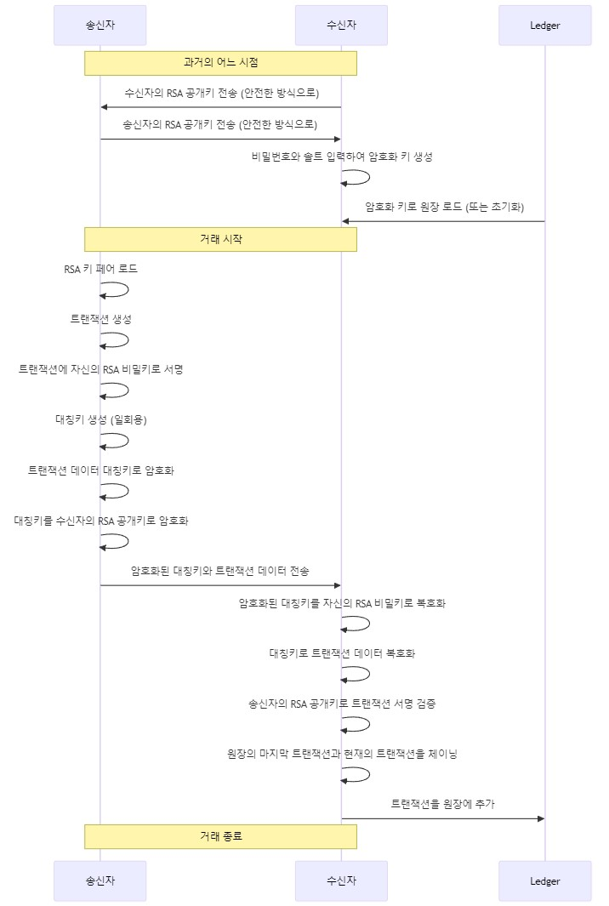

# 블록체인 기반 가치 이전 (Blockchain-based Value Transfer)

To implement the sequence diagram as a program across Windows, macOS, Android, and iOS platforms, a few key technologies and approaches would be suitable:

### 1. **Cross-Platform Development Frameworks**
   - **Flutter** or **React Native**: These frameworks allow you to write the code once and deploy it across all targeted platforms. Both support integrating native modules for platform-specific functionality, such as cryptographic operations.
   - **Xamarin**: This is a C#-based framework that can also target multiple platforms, including mobile and desktop.

### 2. **Programming Languages**
   - **For Mobile (Android & iOS)**:
     - **Kotlin/Java** for Android and **Swift/Objective-C** for iOS if developing separately.
     - **Dart (Flutter)** or **JavaScript/TypeScript (React Native)** for cross-platform apps.
   - **For Desktop (Windows & macOS)**:
     - **C++/C#** or **Python** for shared core logic.
     - **Electron** if you want to use web technologies for the desktop UI.

### 3. **P2P Communication**
   - **libp2p**: A modular network stack that supports P2P communication. It is available in multiple languages (JavaScript, Go, Rust) and can be integrated into various platforms.
   - **WebRTC**: Useful for establishing peer-to-peer communication, especially for real-time data exchange between devices.
   - **gRPC**: Can be configured for P2P, although primarily for client-server. It supports multiple languages and has mobile libraries.

### 4. **Cryptography**
   - **OpenSSL**: Commonly used for cryptographic operations. It's available on all platforms and can be integrated into mobile and desktop applications.
   - **Libsodium**: Another reliable cryptography library that is cross-platform and easier to use than OpenSSL.
   - **BouncyCastle**: For Java/Kotlin (Android) and can be used with .NET (Xamarin) for encryption.

### 5. **Blockchain or Ledger Implementation**
   - **Hyperledger Fabric** or **Corda**: If you need a more complex and distributed ledger, these frameworks support permissioned blockchains.
   - **SQLite**: For a simpler local ledger, especially if each device maintains its copy and syncs over P2P communication.
   - **Custom Blockchain Implementation**: Using a simplified blockchain design based on the P2P logic you want to create.

### 6. **Key Management**
   - **Keychain (iOS/macOS)** and **Keystore (Android)** for secure key storage.
   - **Windows Data Protection API (DPAPI)** for storing cryptographic keys securely on Windows.
   - **Hardware Security Modules (HSM)** or **TPMs** can provide enhanced security for key management if available.
   - 공개키 교환은 Diffie-Hellman 방식으로 한다.

### Development Flow Example
1. **Core Logic**: Write the cryptographic, transaction creation, and validation logic in a language that can be reused across platforms (e.g., C++/Python).
2. **P2P Communication**: Implement using `libp2p` or `WebRTC` to allow direct communication between sender and receiver.
3. **Cryptographic Operations**: Use `Libsodium` or `OpenSSL` for encryption, decryption, and digital signatures.
4. **Platform-Specific Modules**: Write wrappers around native APIs to handle key storage and OS-specific optimizations.

By combining these tools and frameworks, you can develop a robust, cross-platform solution that aligns with your sequence diagram.
