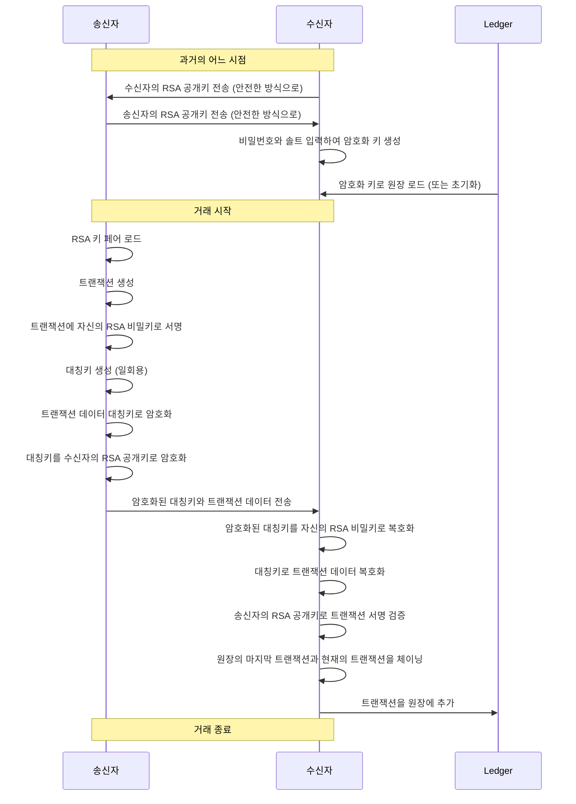
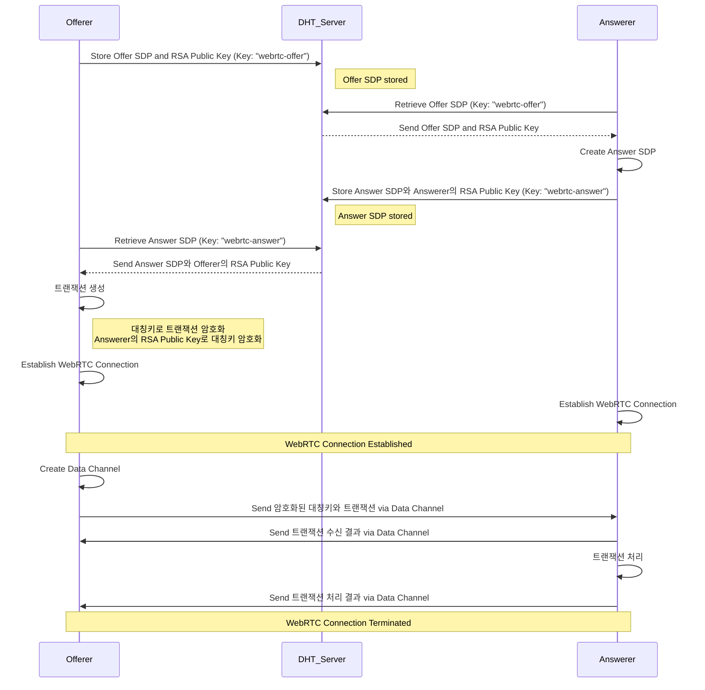

# 블록체인 기반 가치 이전 (Blockchain-based Value Transfer)

To implement the sequence diagram as a program across Windows, macOS, Android, and iOS platforms, a few key technologies and approaches would be suitable:

### 1. **Cross-Platform Development Frameworks**
   - **Flutter** or **React Native**: These frameworks allow you to write the code once and deploy it across all targeted platforms. Both support integrating native modules for platform-specific functionality, such as cryptographic operations.
   - **Xamarin**: This is a C#-based framework that can also target multiple platforms, including mobile and desktop.

### 2. **Programming Languages**
   - **For Mobile (Android & iOS)**:
     - **Kotlin/Java** for Android and **Swift/Objective-C** for iOS if developing separately.
     - **Dart (Flutter)** or **JavaScript/TypeScript (React Native)** for cross-platform apps.
   - **For Desktop (Windows & macOS)**:
     - **C++/C#** or **Python** for shared core logic.
     - **Electron** if you want to use web technologies for the desktop UI.

### 3. **P2P Communication**
   - **libp2p**: A modular network stack that supports P2P communication. It is available in multiple languages (JavaScript, Go, Rust) and can be integrated into various platforms.
   - **WebRTC**: Useful for establishing peer-to-peer communication, especially for real-time data exchange between devices.
   - **gRPC**: Can be configured for P2P, although primarily for client-server. It supports multiple languages and has mobile libraries.

### 4. **Cryptography**
   - **OpenSSL**: Commonly used for cryptographic operations. It's available on all platforms and can be integrated into mobile and desktop applications.
   - **Libsodium**: Another reliable cryptography library that is cross-platform and easier to use than OpenSSL.
   - **BouncyCastle**: For Java/Kotlin (Android) and can be used with .NET (Xamarin) for encryption.

### 5. **Blockchain or Ledger Implementation**
   - **Hyperledger Fabric** or **Corda**: If you need a more complex and distributed ledger, these frameworks support permissioned blockchains.
   - **SQLite**: For a simpler local ledger, especially if each device maintains its copy and syncs over P2P communication.
   - **Custom Blockchain Implementation**: Using a simplified blockchain design based on the P2P logic you want to create.

### 6. **Key Management**
   - **Keychain (iOS/macOS)** and **Keystore (Android)** for secure key storage.
   - **Windows Data Protection API (DPAPI)** for storing cryptographic keys securely on Windows.
   - **Hardware Security Modules (HSM)** or **TPMs** can provide enhanced security for key management if available.
   - 공개키 교환은 Diffie-Hellman 방식으로 한다.

### Development Flow Example
1. **Core Logic**: Write the cryptographic, transaction creation, and validation logic in a language that can be reused across platforms (e.g., C++/Python).
2. **P2P Communication**: Implement using `libp2p` or `WebRTC` to allow direct communication between sender and receiver.
3. **Cryptographic Operations**: Use `Libsodium` or `OpenSSL` for encryption, decryption, and digital signatures.
4. **Platform-Specific Modules**: Write wrappers around native APIs to handle key storage and OS-specific optimizations.

By combining these tools and frameworks, you can develop a robust, cross-platform solution that aligns with your sequence diagram.

---

### 사용할 기술
#### Programming Languages : React Native For Mobile, Electron For Desktop
#### P2P Communication : WebRTC
- peer lookup : DHT (분산 해시 테이블)
#### Cryptography :
#### Blockchain or Ledger Implementation :
#### Key Management : 각자 platform에 맞게

---

WebRTC와 DHT의 조합은 전혀 이상하지 않으며, 오히려 **상호 보완적**으로 사용될 수 있습니다. 두 기술의 장점을 활용하면 P2P 네트워크에서 더 효율적이고 확장 가능한 시스템을 구축할 수 있습니다. 각 기술의 특징과 조합하는 방식에 대해 자세히 설명하겠습니다.

### 1. **WebRTC와 DHT의 역할**
   - **WebRTC**:
     - WebRTC는 **직접적인 P2P 통신**을 가능하게 해주는 기술로, **낮은 지연 시간**의 실시간 데이터 전송이 특징입니다.
     - **STUN/TURN** 서버를 통해 NAT 및 방화벽 문제를 해결하고, 직접 연결을 설정할 수 있게 합니다.
     - 주로 **데이터 전송**과 **미디어 스트리밍**에 적합하며, **RTCDataChannel**을 사용해 파일이나 텍스트 데이터도 전송할 수 있습니다.
   
   - **DHT**:
     - DHT는 **분산 네트워크**에서 피어를 찾아주는 역할을 하며, **중앙 서버 없이** 데이터를 저장하고 검색할 수 있습니다.
     - 노드(피어)들이 서로의 주소 정보를 DHT에 등록하면, 송신자가 수신자를 찾기 위해 DHT에 조회를 할 수 있습니다.
     - **분산 검색**을 통해 피어를 빠르게 찾고, 각 노드의 IP 주소나 연결 정보를 얻어 올 수 있습니다.

### 2. **WebRTC와 DHT의 조합이 유용한 이유**
   - **P2P 연결 설정을 위한 피어 검색**: WebRTC는 직접 연결을 설정하기 위해 초기 단계에서 **Signaling Server**를 사용합니다. 이 서버는 송신자와 수신자 간의 연결 정보를 교환하는 역할을 하지만, 중앙 서버에 의존하기 때문에 완전한 분산 시스템이라고 보기 어렵습니다.
     - **DHT를 Signaling Server 대용으로 사용**하면, 송신자와 수신자가 각자의 연결 정보를 DHT에 등록하고 검색할 수 있게 되어, 중앙 서버 없이도 피어를 찾고 연결할 수 있습니다.
     - 예를 들어, 송신자가 수신자의 고유 ID (예: 해시 값)를 알고 있다면, DHT를 통해 그 ID에 해당하는 피어의 연결 정보를 조회하고 WebRTC 연결을 설정할 수 있습니다.

   - **분산 네트워크의 확장성**: DHT는 네트워크가 커질수록 확장성이 뛰어나며, 새로운 노드가 자유롭게 추가되고 삭제될 수 있습니다. WebRTC로 설정된 P2P 연결이 DHT를 통해 피어 간의 확장성을 높일 수 있습니다.
     - 예를 들어, **BitTorrent**의 경우 DHT를 사용해 피어를 검색하고, 데이터를 전송할 때는 TCP/UDP 연결을 사용합니다. 이 방식과 유사하게 DHT로 피어를 찾고 WebRTC를 통해 데이터를 전송하는 구조를 설계할 수 있습니다.

   - **네트워크 안정성 및 탈중앙화**: 중앙 서버에 의존하지 않기 때문에 서버 장애 시에도 네트워크가 안정적으로 운영될 수 있습니다. DHT는 네트워크의 참여자들 간에 데이터를 분산하여 저장하고 관리하므로, **서버 장애의 위험성**을 최소화합니다.

### 3. **WebRTC + DHT 조합의 실제 동작 예시**
1. **피어 등록 및 검색 (DHT)**
   - 수신자는 자신의 **공개 IP 주소 및 포트 정보**를 DHT에 등록합니다. 이 정보는 WebRTC 연결을 설정할 때 사용할 수 있습니다.
   - 송신자가 특정 수신자에게 연결하고 싶다면, DHT를 통해 수신자의 IP 주소 및 포트 정보를 검색합니다.
   
2. **WebRTC 연결 설정 (P2P)**
   - 송신자는 검색된 정보를 바탕으로 WebRTC의 **Signaling** 절차를 수행합니다. 송신자와 수신자는 ICE Candidate 정보를 교환하여 최적의 P2P 경로를 설정합니다.
   - 이 과정에서 DHT는 초기 Signaling 서버의 역할을 대신하게 됩니다.

3. **데이터 전송**
   - 연결이 설정되면 **RTCDataChannel**을 통해 송신자와 수신자는 실시간으로 데이터를 주고받을 수 있습니다.
   - 이때 WebRTC는 NAT 방화벽을 넘어서 P2P 연결을 유지하며, **STUN/TURN 서버**를 통해 필요할 경우 중계 역할을 수행합니다.

### 4. **구체적인 사용 사례**
   - **P2P 파일 공유 애플리케이션**: 기존 BitTorrent와 유사한 방식으로, WebRTC와 DHT를 조합하여 완전한 탈중앙화 파일 공유 네트워크를 구축할 수 있습니다.
     - DHT를 사용해 파일을 가지고 있는 피어들을 찾고, WebRTC를 통해 파일을 직접 다운로드합니다.
   - **분산 메시징 시스템**: 중앙 서버 없이 WebRTC를 통해 메시지를 실시간으로 주고받을 수 있습니다.
     - 송신자가 메시지를 전송하기 전에 DHT로 수신자를 찾고, WebRTC 연결을 설정해 안전한 메시지를 전송합니다.
   - **P2P 게임 네트워크**: 게임 내에서 플레이어들 간의 직접 연결을 통해 빠르고 지연 없는 네트워크 환경을 제공합니다.
     - 플레이어의 IP 및 연결 정보는 DHT에 등록되어 있으며, 게임 세션이 시작되면 WebRTC를 통해 연결이 설정됩니다.

### 5. **잠재적인 도전 과제 및 해결 방안**
   - **NAT Traversal 문제**: DHT는 피어의 실제 IP 주소와 포트를 사용하기 때문에 NAT 방화벽이 있을 경우 문제가 발생할 수 있습니다. WebRTC의 **STUN/TURN** 서버를 활용해 NAT 문제를 해결할 수 있습니다.
   - **보안 문제**: DHT는 기본적으로 공개된 분산 네트워크이기 때문에, 모든 피어가 데이터를 볼 수 있습니다. WebRTC 연결을 통해 전송할 데이터는 **암호화**하는 것이 필요합니다. WebRTC는 기본적으로 **DTLS**를 사용해 데이터 전송을 암호화합니다.
   - **DHT의 안정성**: 네트워크에 악의적인 피어가 있다면 잘못된 정보를 전송할 수 있습니다. **신뢰 기반의 DHT 프로토콜**을 사용하거나, 데이터를 추가적으로 검증하는 메커니즘을 도입하여 안정성을 높일 수 있습니다.

결론적으로, **WebRTC와 DHT의 조합은 매우 유용하고 실용적인 솔루션**이 될 수 있습니다. DHT는 피어 검색과 네트워크 탈중앙화를 담당하고, WebRTC는 실시간 데이터 전송과 NAT 방화벽 문제 해결을 담당함으로써, 두 기술이 상호 보완적으로 동작할 수 있습니다. 이러한 조합은 완전한 P2P 네트워크 구축을 목표로 하는 여러 프로젝트에서 강력한 기반이 될 수 있습니다.

